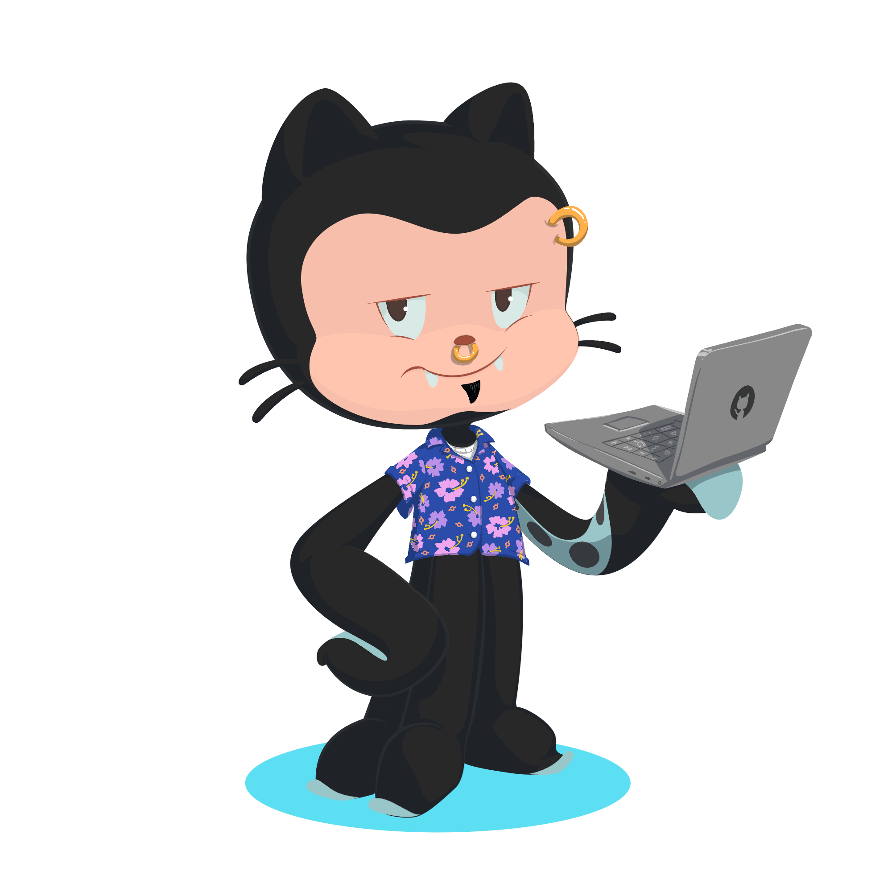
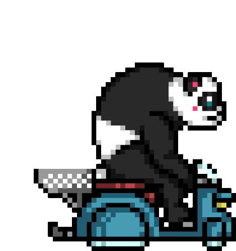

  

  
 
<pre>
    💼 Computer Engineer
    🎮 Games • Anime • Code • Art
</pre>
 
  

  

  

<pre>A little bit of what I've been doing</pre>

<picture>
  <source
    media="(prefers-color-scheme: dark)"
    srcset="dist/github-snake-dark.svg"
  />
  <source
    media="(prefers-color-scheme: light)"
    srcset="dist/github-snake.svg"
  />
  
</picture>

